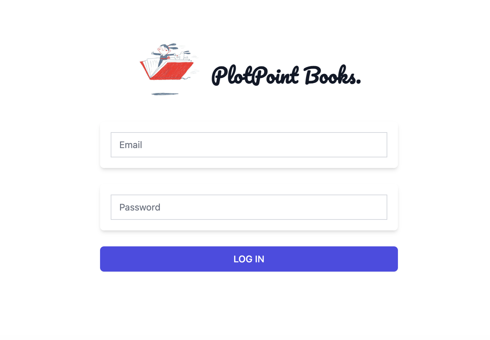
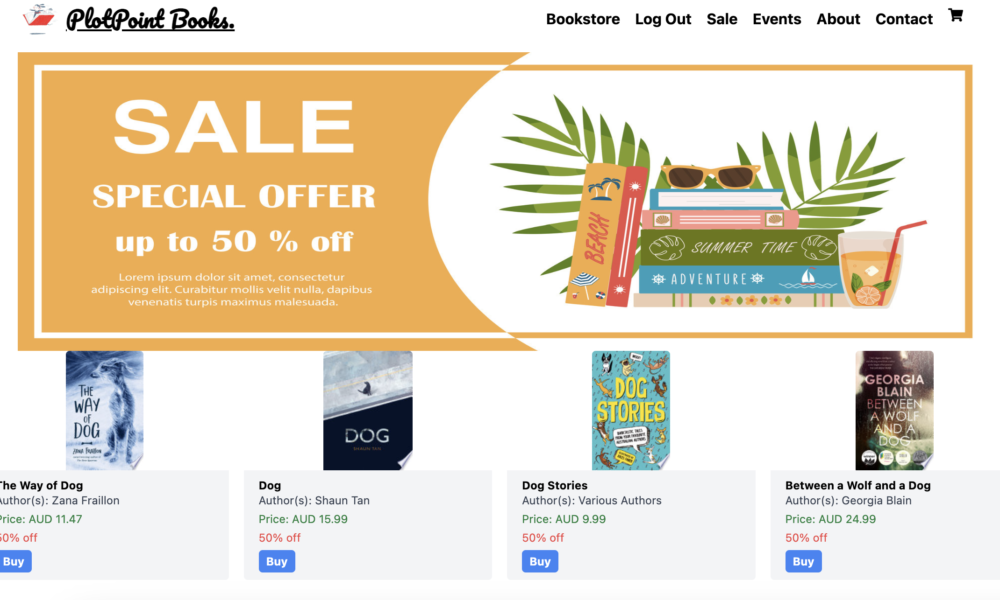
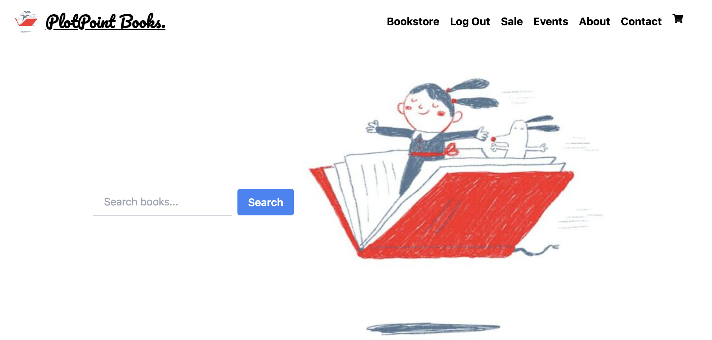
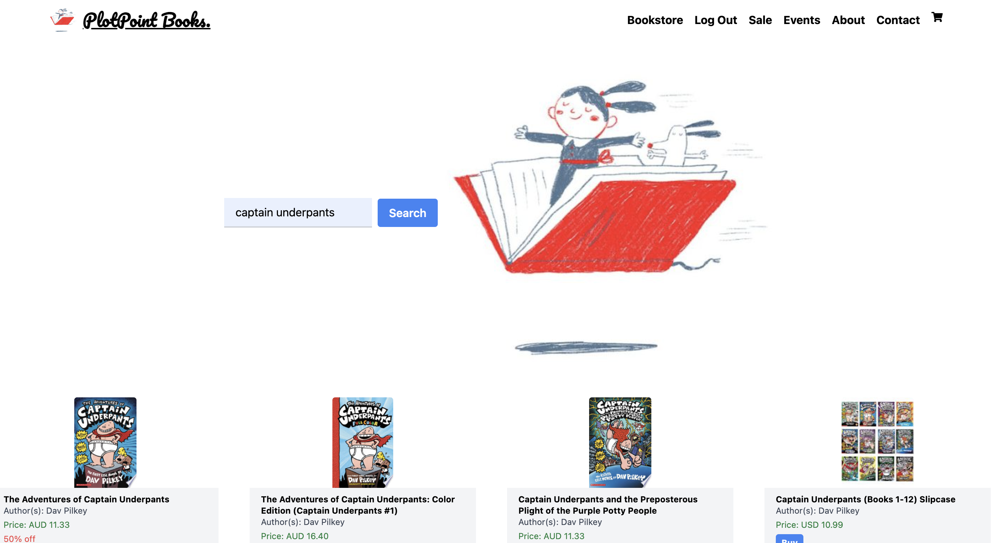

# PlotPoint Books

Welcome to PlotPoint Books! This platform provides a convenient way for users to browse and purchase books online. Below is an overview of how the website functions:

## Features

- **User Authentication**: Users must sign up or log in to access the full functionality of the website. This ensures a personalized experience and enables users to keep track of their orders.
  
- **Sale Component**: Upon signing up or logging in, users are directed straight to the application's sale component. This component displays a curated list of books currently on sale, making it easy for users to discover discounted items.
  
- **Book Store**: Users can navigate to the book store using the navigation bar. Here, they can search for their desired books using various filters such as genre, author, or title. The book store provides a comprehensive collection of books available for purchase.
  
- **Add to Cart**: Users can add books to their cart by clicking the "Buy" button on the book's detail page. This action instantly adds the selected book to the user's cart for easy checkout.
  
- **View Cart**: To view the books added to their cart, users can click on the cart icon in the navigation bar. This provides a quick overview of the items in the cart, allowing users to review their selections before proceeding to checkout.

## Getting Started

To get started with PlotPoint Books, follow these steps:

1. **Sign Up or Log In**: If you're a new user, sign up for an account to access the full features of the website. If you're an existing user, simply log in to your account.

2. **Explore Sale Component**: Once logged in, you'll be directed straight to the sale component, where you can browse through discounted books and find great deals.

3. **Browse Book Store**: Use the navigation bar to explore the book store and search for specific books using the search bar.

4. **Add to Cart**: When you find a book you want to purchase, click the "Buy" button on the book's detail page to add it to your cart.

5. **View Cart**: To view the books added to your cart, click on the cart icon in the navigation bar. 

- deployment link: 

## Tech Stack

- Frontend: React.js, Tailwind CSS
- Backend: Node.js, Express.js
- Database: MongoDB
- Authentication: JWT (JSON Web Tokens)
- Vite
- Render

## Ice Box Items 
additionally I would like the cart to also include checkout functionality.
I would also like to explore Socket io to impliment having a "book club" option where logged in users can discuss books with other users.  

